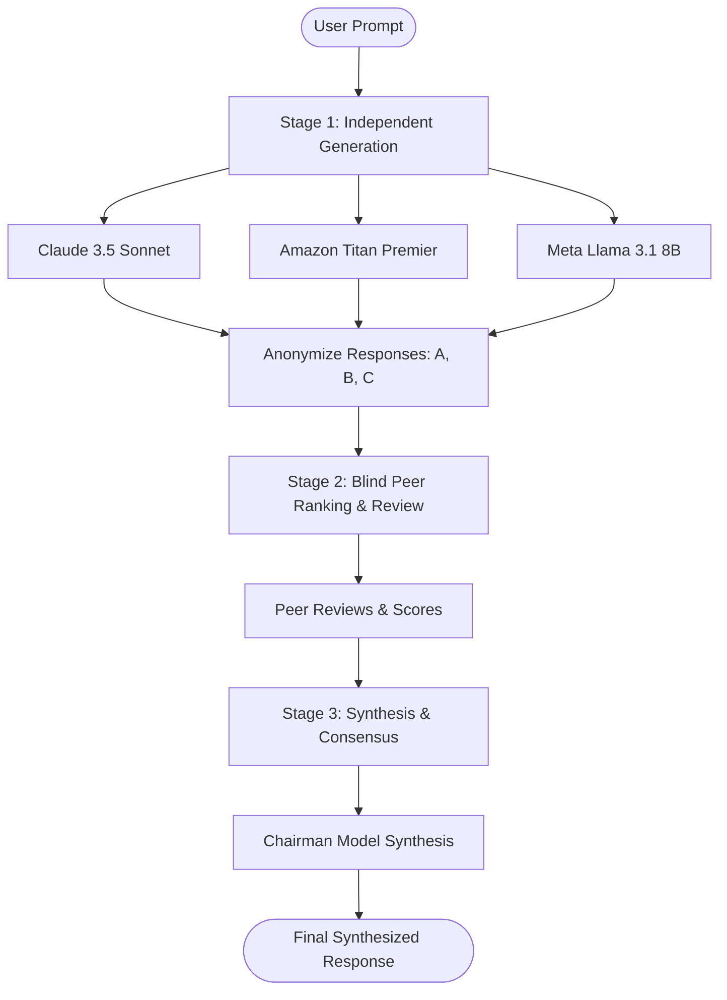

# LLM Council: Comprehensive System Architecture & Technical Deep-Dive

> **Platform Overview:** The LLM Council is an enterprise-grade, cloud-native multi-agent deliberation platform powered by AWS services. It leverages an anonymized 3-Stage Peer Review Deliberation Pipeline to eliminate single-model bias, reduce hallucinations, and synthesize consensus responses across diverse state-of-the-art Large Language Models.

---

## 📋 Table of Contents
1. [Executive Summary & Core Concept](#1-executive-summary--core-concept)
2. [Why LLM Council Stands Out](#2-why-llm-council-stands-out)
3. [System Architecture](#3-system-architecture)
4. [3-Stage Deliberation Engine Deep-Dive](#4-3-stage-deliberation-engine-deep-dive)
5. [AWS Cloud Integration Architecture](#5-aws-cloud-integration-architecture)
6. [Technology Stack](#6-technology-stack)
7. [Data Model & Persistence Strategy](#7-data-model--persistence-strategy)
8. [Security & Authentication Architecture](#8-security--authentication-architecture)
9. [Advantages & Disadvantages (Trade-off Analysis)](#9-advantages--disadvantages-trade-off-analysis)
10. [End-to-End Execution Flow](#10-end-to-end-execution-flow)

---

## 1. Executive Summary & Core Concept

Standard single-model LLM interactions suffer from inherent limitations:
- **Model Bias & Preference:** Individual models have stylistic biases, training distribution gaps, and specific reasoning flaws.
- **Hallucinations:** A single model can confidently present incorrect information with no checks or balances.
- **Lack of Consensus:** High-stakes decision-making requires corroboration from multiple distinct reasoning engines.

**The LLM Council solves this by introducing a democratic, blind peer-review deliberation process.** Instead of querying a single model, user prompts are submitted to a "Council" of diverse models (e.g., Anthropic Claude 3.5 Sonnet, Meta Llama 3.1 8B, Amazon Titan Text Premier). The models independently answer, anonymously evaluate and rank each other's work, and finally a Chairman model synthesizes a unified consensus answer based on the highest-ranked insights.



---

## 2. Why LLM Council Stands Out

| Feature | Single LLM Approach | Traditional Multi-Prompt | LLM Council Platform |
| :--- | :--- | :--- | :--- |
| **Bias Mitigation** | ❌ High single-model bias | ⚠️ Manual comparison needed | ✅ **Blind Anonymized Peer Ranking** |
| **Hallucination Detection**| ❌ None | ⚠️ User must manually cross-check | ✅ **Automated Cross-Model Verification** |
| **Synthesis Quality** | ❌ N/A | ❌ Raw outputs shown side-by-side | ✅ **Stage 3 Single Unified Super-Response** |
| **Enterprise Security** | ⚠️ Varies | ⚠️ Unmanaged API keys | ✅ **AWS Cognito JWT + IAM Isolation** |
| **Storage & Scale** | ❌ Local storage | ❌ In-memory / ephemeral | ✅ **DynamoDB Single-Table Cloud Storage** |
| **Telemetry & Observability** | ❌ None | ❌ Basic logs | ✅ **Amazon CloudWatch Metrics & Telemetry** |

### Key Differentiating Factors:
1. **Blind Anonymization (Anti-Self-Preference Bias):** Models are prone to favoring their own outputs if they recognize their brand/format. In Stage 2, all responses are stripped of model identifiers and labeled neutrally (`Response A`, `Response B`, etc.).
2. **Collective Intelligence Synthesis:** The Chairman model does not just pick a winner; it integrates the best reasoning steps, facts, and code blocks from all responses while discounting flawed rationale identified in Stage 2.
3. **AWS Cloud-Native Security:** Built with AWS Bedrock for managed model access, AWS Cognito for identity federation, and DynamoDB for serverless, low-latency persistence.

---

## 3. System Architecture

The LLM Council follows a modern decoupled architecture: React (Vite) frontend with an AWS-inspired dark UI communicating with a FastAPI (Python) backend via REST and Server-Sent Events (SSE).

```
+-----------------------------------------------------------------------------------+
|                                 FRONTEND (React)                                  |
|  - AWS Console Dark Theme UI (Neuros Engine Telemetry & Claude-style Aesthetics) |
|  - Cognito Auth Modal (JWT Storage in localStorage)                              |
|  - Real-time Stage 1/2/3 Deliberation View & SSE Streaming                       |
+-----------------------------------------------------------------------------------+
                                         |
                                  HTTP / REST API
                                         |
+-----------------------------------------------------------------------------------+
|                                 BACKEND (FastAPI)                                 |
|  - CognitoAuthMiddleware (JWT Verification & Public Path Exemption)              |
|  - CORS Middleware & Session Management                                           |
|  - Deliberation Engine (Stage 1, Stage 2, Stage 3 Orchestration)                 |
+-----------------------------------------------------------------------------------+
          |                                  |                                 |
          v                                  v                                 v
+-------------------+              +-------------------+             +-------------------+
|  AMAZON BEDROCK   |              |  AMAZON DYNAMODB  |             |  AMAZON COGNITO   |
| - Claude 3.5      |              | - Single-Table    |             | - User Pool       |
| - Titan Premier   |              |   Storage         |             | - App Client      |
| - Llama 3.1 8B    |              | - PK/SK Indexing  |             | - JWT Auth Tokens |
+-------------------+              +-------------------+             +-------------------+
          |
          v
+-------------------+
| AMAZON CLOUDWATCH |
| - API Metrics     |
| - Latency Logs    |
+-------------------+
```

---

## 4. 3-Stage Deliberation Engine Deep-Dive

### Stage 1: Independent Response Generation
* **Goal:** Collect unbiased, diverse answers from all council models.
* **Mechanism:** The user's prompt is dispatched concurrently using Python's `asyncio.gather` to all active Bedrock models.
* **Prompt Isolation:** Models receive only the conversation history and current prompt. They have no knowledge of what other models are in the council.

### Stage 2: Peer Review & Blind Ranking
* **Goal:** Evaluate the quality, accuracy, and logic of each Stage 1 response.
* **Mechanism:**
  1. The Stage 1 responses are anonymized: Model names are replaced with random labels (`Response A`, `Response B`, `Response C`).
  2. A review prompt is constructed asking each model to:
     - Critique each anonymized response.
     - Assign a numerical rank/score.
     - Justify its ranking based on correctness, clarity, and completeness.
  3. Responses are parsed to extract rankings and structured critiques.

### Stage 3: Synthesis & Consensus Generation
* **Goal:** Produce a single, authoritative final answer.
* **Mechanism:**
  1. Aggregate scores from Stage 2 are calculated to form a consensus ranking matrix.
  2. A Chairman Model (typically Anthropic Claude 3.5 Sonnet) is provided with:
     - The original user query.
     - All Stage 1 responses.
     - All Stage 2 critiques and consensus rankings.
  3. The Chairman synthesizes the definitive answer, incorporating the strongest elements and resolving any contradictions noted by the council.

---

## 5. AWS Cloud Integration Architecture

The application natively integrates four core AWS services:

### 1. Amazon Bedrock (LLM Provider)
* **Purpose:** Serverless execution of foundation models without managing GPU infrastructure.
* **Models Utilized:**
  - `anthropic.claude-3-5-sonnet-20241022-v2:0` (High-reasoning Council Member & Chairman)
  - `amazon.titan-text-premier-v2:0` (General text & structured reasoning)
  - `meta.llama3-1-8b-instruct-v1:0` (Fast, lightweight open-weights model)
* **Client Implementation:** Uses `boto3.client('bedrock-runtime')` with fallback mechanism to OpenRouter API if Bedrock is not available.

### 2. Amazon DynamoDB (Storage Backend)
* **Purpose:** NoSQL serverless database for low-latency storage of conversations and multi-stage messages.
* **Table Name:** `LLMCouncilConversations`
* **Single-Table Design Pattern:**
  - `PK` (Partition Key): `USER#<user_sub>` or `CONV#<conv_id>`
  - `SK` (Sort Key): `METADATA` or `MSG#<timestamp>`
* **Features:** Automatic table creation on startup (`ensure_table_exists`), TTL support, and transactional consistency.

### 3. Amazon Cognito (Identity & Access Management)
* **Purpose:** Managed user authentication, sign-up, sign-in, and JWT issuance.
* **User Pool ID:** `us-east-1_YjhPxkgXo`
* **Client ID:** `38oi9lenc41g9c8gnibedf1ta0`
* **Auth Flow:** `ALLOW_USER_PASSWORD_AUTH` flow for custom frontend auth modal integration.
* **Backend Guard:** `CognitoAuthMiddleware` intercepts API routes, verifies token signatures, audience (`aud`), issuer (`iss`), and expiration (`exp`).

### 4. Amazon CloudWatch (Observability)
* **Purpose:** Telemetry and request monitoring.
* **Metrics Recorded:** API request counts, deliberation pipeline latency, Bedrock invocation errors, and active user sessions.

---

## 6. Technology Stack

### Frontend Stack
* **Framework:** React 18 (Vite)
* **Styling:** Custom Vanilla CSS + Tailwind CSS utilities with AWS Console Dark Theme aesthetics (Slate Navy `#0f172a`, AWS Amber `#ff9900`, Dark Slate `#1e293b`).
* **Icons:** `lucide-react`
* **State Management:** React Hooks (`useState`, `useEffect`, `useCallback`)
* **API Layer:** Fetch API with JWT Authorization header injection (`frontend/src/api.js`).

### Backend Stack
* **Framework:** FastAPI (Python 3.11+)
* **ASGI Server:** Uvicorn
* **AWS SDK:** `boto3` & `botocore`
* **Validation:** Pydantic v2
* **Middleware:** Starlette `BaseHTTPMiddleware`, CORS Middleware

---

## 7. Data Model & Persistence Strategy

DynamoDB Single-Table Schema layout:

| Item Type | Partition Key (`PK`) | Sort Key (`SK`) | Attributes |
| :--- | :--- | :--- | :--- |
| **Conversation Metadata** | `USER#<user_sub>` | `CONV#<conv_id>` | `id`, `title`, `created_at`, `message_count` |
| **Conversation Detail** | `CONV#<conv_id>` | `METADATA` | `id`, `user_sub`, `title`, `created_at` |
| **Stage 1 Message** | `CONV#<conv_id>` | `MSG#<msg_id>#STAGE1` | `role`, `stage1_responses` (Dict of model -> text) |
| **Stage 2 Message** | `CONV#<conv_id>` | `MSG#<msg_id>#STAGE2` | `stage2_reviews` (Dict of model -> review) |
| **Stage 3 Message** | `CONV#<conv_id>` | `MSG#<msg_id>#STAGE3` | `content` (Final synthesized text), `rankings` |

---

## 8. Security & Authentication Architecture

Authentication is strictly enforced across the stack:

1. **User Sign-Up / Sign-In:** User enters credentials in `CognitoAuthModal.jsx`. Request is routed to `/api/auth/signup` or `/api/auth/signin`.
2. **Token Storage:** Upon successful sign-in, Cognito returns an `access_token` and `id_token`. The frontend stores these securely in browser `localStorage`.
3. **Request Interception:** Every outbound request via `api.js` attaches `Authorization: Bearer <access_token>`.
4. **Middleware Validation:** `CognitoAuthMiddleware` in FastAPI validates the JWT payload against Cognito JWKS before granting access to protected endpoints (`/api/conversations/*`).
5. **Public Path Exemptions:** `PUBLIC_PATHS` (`/`, `/health`, `/docs`, `/api/system/config`, `/api/auth/*`) bypass authentication for landing, health checks, and login flows.

---

## 9. Advantages & Disadvantages (Trade-off Analysis)

### Key Advantages
1. **Unmatched Accuracy & Reliability:** Reduces hallucination rates significantly by forcing peer models to audit each other's claims.
2. **Vendor Neutrality & Diversification:** Prevents dependence on a single AI provider by mixing Anthropic, Meta, and Amazon models.
3. **Enterprise-Ready Infrastructure:** Cloud-native architecture utilizing AWS serverless infrastructure scales seamlessly with zero server management overhead.
4. **Transparent Deliberation:** Users can inspect raw individual responses (Stage 1), peer reviews (Stage 2), and consensus rankings alongside the final answer (Stage 3).

### Disadvantages & Trade-offs
1. **Higher Latency:** Running 3 sequential stages takes longer (typically 5–15 seconds) than a single LLM API call (1–3 seconds).
2. **Increased API Cost:** A single query triggers multiple model invocations across Stage 1, Stage 2, and Stage 3, increasing token consumption.
3. **Model Quota Sensitivity:** Requires sufficient AWS Bedrock quota limits across all selected models in the target region (`us-east-1`).

---

## 10. End-to-End Execution Flow

Below is the step-by-step sequence when a user submits a prompt:

```
[User Types Prompt] -> [Frontend api.js sends POST /api/conversations/{id}/messages]
                             |
                             v
                 [CognitoAuthMiddleware]
             (Validates Bearer JWT Token)
                             |
                             v
                  [FastAPI backend/main.py]
                             |
           +-----------------+-----------------+
           |                                   |
           v                                   v
   [Save User Message]                [Initiate Deliberation]
      (DynamoDB)                        (backend/council.py)
                                               |
                                               v
                                   [Stage 1: Parallel Invocation]
                                   - Bedrock Claude 3.5 Sonnet
                                   - Bedrock Titan Premier
                                   - Bedrock Llama 3.1 8B
                                               |
                                               v
                                   [Anonymize Responses A, B, C]
                                               |
                                               v
                                   [Stage 2: Parallel Peer Review]
                                   - Models critique & rank A, B, C
                                               |
                                               v
                                   [Stage 3: Synthesis]
                                   - Chairman synthesizes final answer
                                               |
                                               v
                                   [Save Deliberation Result]
                                          (DynamoDB)
                                               |
                                               v
                                   [Return JSON / Stream SSE]
                                               |
                                               v
                                   [Render Stage 1, 2, 3 in React UI]
```

---
*Documentation maintained for LLM Council Platform — AWS Cloud Edition.*
